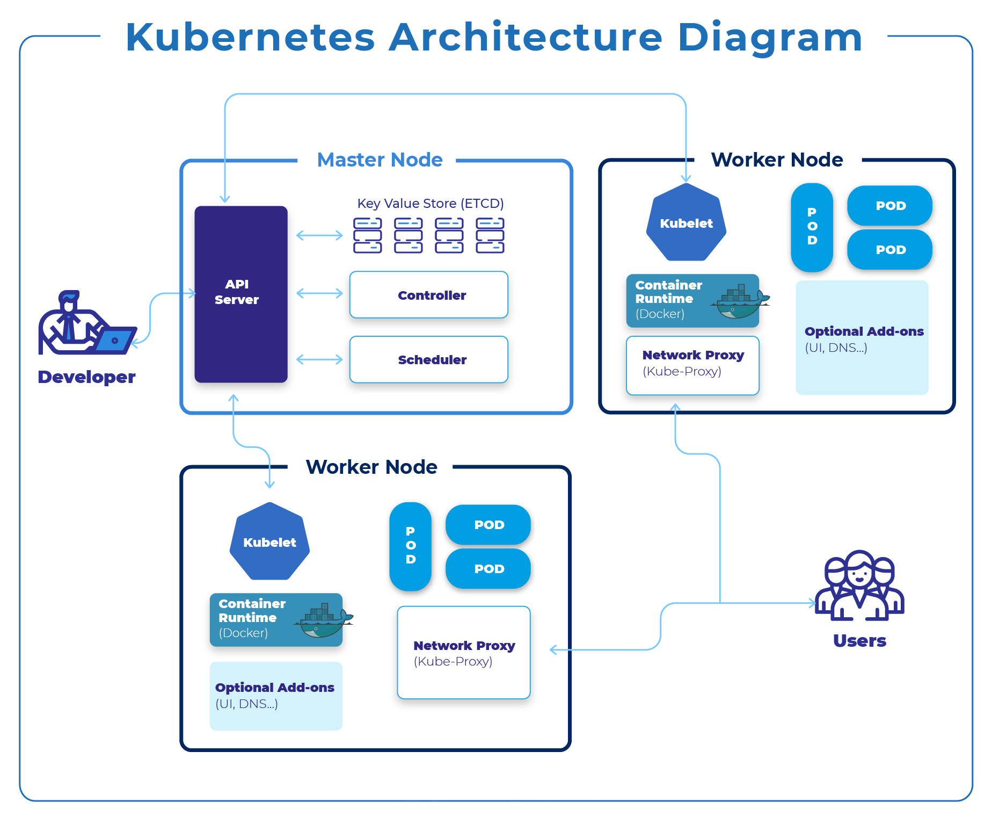

# Kubernetes Theory: A Comprehensive Guide

## **Distributed Computing**

Distributed computing refers to a system where multiple computers (or nodes) work together to solve a large problem or process data collaboratively. Tasks are divided among the nodes, enabling parallel processing for faster and more efficient computation.

### **Components of Distributed Computing**

- **Cluster**: A group of interconnected computers or servers that work together as a single system. Each computer in the cluster is called a node, and they collaborate to share workloads, provide redundancy, and improve performance.

- **Lead-Node Server**: The lead-node (or master node) in a distributed system is responsible for managing the cluster. It coordinates tasks like assigning workloads to worker nodes, monitoring their health, and ensuring everything runs smoothly.

- **Communication**: Refers to how nodes in the cluster exchange data and instructions through network protocols, ensuring synchronization, task distribution, and data sharing among nodes.

- **Concurrency (Speed, Fault Tolerance)**: Allows multiple tasks to run simultaneously across nodes, boosting speed and ensuring fault tolerance—if one node fails, the workload is shifted to others, preventing disruptions.

- **Comparison with Apache Spark Internally (MapReduce)**: Apache Spark uses the **MapReduce** model, where tasks are divided into "map" (processing) and "reduce" (aggregation) steps. Kubernetes, on the other hand, provides a general-purpose framework for orchestrating containerized workloads and does not impose a specific computation model.

## **Benefits of Distributed Computing**

- **Scalability**: Enables handling larger workloads by distributing tasks among multiple machines.
- **Fault Tolerance**: If one machine fails, tasks can be redistributed to ensure continued operations.
- **Improved Performance**: Parallel processing reduces latency and speeds up applications.
- **Cost Efficiency**: Uses multiple inexpensive machines instead of costly high-performance hardware.
- **Flexibility**: Supports diverse hardware and cloud providers for adaptable infrastructure.

---

## **Microservices: The Real-World Scenario**

Microservices break down applications into smaller, independent components, each handling a specific task. For example, in a movie recommendation system:

1. **Data Ingestion Service**: Collects and processes data from users.
2. **Feature Engineering Service**: Transforms raw data into meaningful inputs.
3. **Training Service**: Continuously trains and updates recommendation models.
4. **Model Serving Service**: Hosts the trained model and responds to user queries.
5. **UI Service**: Displays the user interface and interacts with backend services.

**Real-Life Analogy**: Microservices are like a food court where each stall specializes in one cuisine. If one stall runs out of ingredients, it doesn’t affect others, and customers can order from multiple stalls efficiently.

---

## **Challenges of Distributed Computing**

- **Resource Management**: Ensuring balanced CPU, memory, and storage allocation.
- **Scaling**: Adding or removing machines dynamically to meet demand.
- **Communication and Networking**: Managing constant communication between nodes.
- **Fault Handling**: Detecting failures, recovering data, and rerouting tasks.
- **Load Balancing**: Distributing workloads efficiently to optimize performance.
- **Configuration and Deployment**: Managing software deployment across multiple nodes.
- **Monitoring and Debugging**: Identifying issues in a distributed environment.

---

## **How Kubernetes Addresses These Challenges**

Kubernetes is a **container orchestration platform** designed to solve distributed computing challenges:

1. **Automated Resource Management**: Ensures optimal workload distribution across nodes.
2. **Effortless Scaling**: Automatically adjusts workloads based on demand.
3. **Reliable Networking**: Provides seamless pod communication.
4. **Self-Healing**: Restarts crashed pods and reschedules workloads automatically.
5. **Load Balancing**: Distributes traffic evenly across healthy pods.
6. **Simplified Deployment**: Uses declarative YAML files for automated deployment.
7. **Centralized Monitoring and Debugging**: Integrates with Prometheus and ELK Stack for system insights.

---

## **Kubernetes Internals**

### **Master Node (Control Plane)**
- **API Server**: The central interface for interacting with Kubernetes.
- **Database (etcd)**: Stores cluster data and configurations.
- **Scheduler**: Assigns new pods to the most suitable worker nodes.
- **Resource Manager**: Allocates CPU, memory, and storage efficiently.

### **Worker Node**
- **Kubelet**: Ensures containers run as expected.
- **Kube-Proxy**: Manages network traffic between pods.
- **Pods**: The smallest deployable Kubernetes units, containing one or more containers.
- **SharedDB (Volumes)**: Provides shared storage for pods.

### **Other Key Concepts**
- **Kube-Manifest (YAML)**: Configuration files defining Kubernetes workloads.
- **Services**: Stable network endpoints for accessing sets of pods.
- **Namespaces**: Virtual clusters within a Kubernetes cluster for resource organization.
- **ReplicaSets**: Maintain a specified number of identical pods.

**Real-Life Analogy: Kubernetes in Action**
- **Without Kubernetes**: Managing a restaurant chain manually.
- **With Kubernetes**: A central system automates ingredient restocking, staffing, and customer redirection.

---

## **Connecting Microservices to Docker and Kubernetes**

### **Docker: Packaging the Microservices**
Each microservice runs inside a **Docker container**, ensuring consistency across environments.

- Example:
  - The Data Ingestion Service is packaged in one container.
  - The Model Serving Service is packaged in another.

### **Kubernetes: Orchestrating the Microservices**
Kubernetes ensures microservices run efficiently:

1. **Scaling**: Deploys more replicas when needed.
2. **Networking**: Manages inter-service communication.
3. **Load Balancing**: Distributes user requests across multiple replicas.

---

## **Advantages of Microservices for ML in Docker-Kubernetes**

1. **Independent Scaling**: Scale only the required service, optimizing resource usage.
2. **Resilience**: If one service fails, others continue running.
3. **Flexibility**: Different services can use different languages or frameworks.

---

## **Summary**

- **Distributed Computing**: Enables scalability, fault tolerance, and improved performance.
- **Microservices**: Break ML workflows into independent components for better scalability and flexibility.
- **Kubernetes**: Automates and optimizes containerized applications, making it essential for modern distributed systems.

By leveraging **Kubernetes, Docker, and microservices**, organizations can efficiently manage and scale machine learning workflows, ensuring high availability and performance in production environments.

